## Problema di Fibonacci
Un buon modello di calcolo per permetterci di analizzare in maniera più *qualitativa* la complessità temporale e spaziale è il **Problema di Fibonacci**.
### L'isola dei conigli
> [!question] Domanda di Leonardo da Pisa
> Quanto velocemente si riprodurrebbe una popolazione di conigli in certe condizioni?

Questa è la domanda che si è fatto Leonardo da Pisa, partendo da un isola deserta con due conigli.

Le regole ci permettono di studiare meglio questo problema sono le seguenti:
- Una coppia di conigli concepisce due coniglietti di sesso diverso ogni anno, i quali formeranno una nuova coppia.
- La gestazione dura un anno.
- I conigli cominciano a riprodursi soltanto al secondo anno dopo la loro nascita.
- I conigli sono immortali.
### La regola di espansione
> [!note] Relazione di Ricorrenza
> Abbiamo che nell'anno $n$ ci sono tutte le coppie dell'anno precedente e una nuova coppia di conigli per ogni coppia presente due anni prima.

Chiamiamo allora $F_n$ il numero di coppie rispetto all'anno n e imponiamo la seguente relazione di ricorrenza:

$$
F_{n}=
\begin{cases}
F_{n-1} + F_{n-2}&&se\ n\geq 3 \\
1&&se\ n =1,2
\end{cases}
$$
### Come si calcola $F_n$?
#### Algoritmo Uno - Formula Diretta
^66510c

> [!tip] Algoritmo Fibonacci1 - Approccio Numerico
> Questo approccio è molto numerico e calcola direttamente il numero di Fibonacci

Formula:
$$
\begin{array}{}
\displaystyle F_{n}=\frac{1}{\sqrt{5}}(\phi^n-\hat{\phi^n})\quad dove & \displaystyle \phi = \frac{1 + \sqrt{ 5 }}{2} \approx +1.618 \\
& \displaystyle \hat{\phi} = \frac{1 - \sqrt{ 5 }}{2} \approx -0.618
\end{array}
$$

**Pseudo-codice:**
> $\displaystyle\text{algoritmo fibonacci1(int n)} \to \text{int}:$
> 	$\displaystyle\text{return }\left( \frac{\phi^n-\hat{\phi}^n}{\sqrt{ 5 }} \right)$

**Implementazione Python:**
```python
def fibonacci1(n: int) -> int:
	return int((pow((1+sqrt(5))/2, n) - pow((1-sqrt(5))/2, n)) / sqrt(5))
```

> [!warning] Problema di Correttezza
> Ma questo algoritmo è corretto? **No!**
>
> A causa **dell'approssimazione limitata** dei due $\phi$ non riusciamo ad arrivare sempre al valore corretto. Aumentando però l'approssimazione troveremo sempre verso infinito un numero che verrà calcolato in maniera errata, quindi non è corretto.

---
#### Algoritmo Due - Ricorsione Diretta
^2bb139

> [!tip] Algoritmo Fibonacci2 - Ricorsione Pura
> Per evitare i problemi di approssimazione possiamo usare precisamente la *Formula di espansione*

**Pseudo-codice:**
> $\text{algoritmo fibonacci2(int n)} \to \text{int}:$
> 	$\text{if } (n\leq 2) \text{ then return 1}$
> 	$\text{else return fibonacci}(n-1)+\text{fibonacci2}(n-2)$

**Implementazione Python:**
```python
def fibonacci2(n: int) -> int:
	if n < 2:
		return n
	else:
		return fibonacci2(n-1) + fibonacci2(n-2)
```

> [!check] Correttezza
> Questo algoritmo rispetta la tecnica del *divide et impera* (ricorsione). Rispettando effettivamente la formula di espansione di base, possiamo dire che **l'algoritmo è corretto**.

> [!question] Ma è efficiente?

**Analisi della complessità:**
In ogni modello di calcolo rudimentale ogni linea di codice costa un'unità di tempo. Di conseguenza calcoliamo le linee di codice mandate in esecuzione:
- Se $n\leq 2$ allora abbiamo una linea di codice.
- Se $n = 3$ ci sono quattro linee di codice, due per la chiamata fibonacci2(3) e una per fibonacci2(2) e fibonacci2(1).
- Se invece è $n$? Cerchiamo di studiarlo tramite una funzione $f(n)$..

Quindi definendo $f(n)$ come *# di linee di codice eseguite dall'algoritmo sull'input n*.

Quindi $f(n)=2+f(n-1)+f(n-2)$  e  $f(1)=f(2)=1$ ma a cosa corrisponde? Questa è quella che chiamiamo **equazione di ricorrenza**.

Per risolverla usiamo un **albero della ricorsione**:
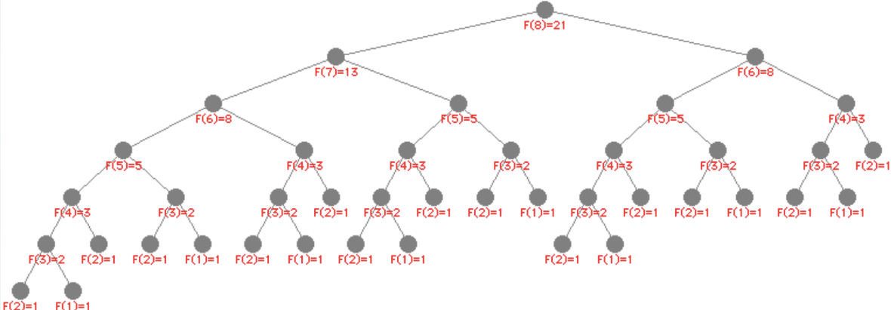

I nodi alla base dell'albero sono i **casi base** (o foglie), in quanto non eseguono ricorsioni. Per dedurre una formula dobbiamo capire quante foglie e nodi interni possiede l'albero.

Per i [[#Primo Lemma|Lemmi]] che vedrai di seguito abbiamo quindi che $T(n)\approx F_{n} \approx O(\phi^n)$. Quindi l'algoritmo è *molto lento*.

---
#### Algoritmo Tre - Programmazione Dinamica (Array)
> [!tip] Algoritmo Fibonacci3 - Caching con Array
> L'idea è di memorizzare i valori calcolati per permettere ai successivi calcoli di essere semplificati in linea di tempo (Caching).

**Pseudo-codice:**
> $\text{algoritmo fibonacci3(int n)} \to \text{int}$
> 	$\text{sia Fib un array di interi}$
> 	$Fib[1] \gets 1,Fib[2]\gets 1$
> 	for $i=3$ to $n$ do
> 		$Fib[i]\gets Fib[i-1]+Fib[i-2]$
> 	return $Fib[n]$

**Implementazione Python:**
```python
def fibonacci3(n: int) -> int:
	Fib = [0, 1]
	for i in range(3, n):
		Fib.append(Fib[i-1] + Fib[i-2])
	return Fib[n-1]
```

**Tempo di esecuzione:**

La prima, la seconda e l'ultima riga di codice vengono eseguite una sola volta, mentre la terza e la quarta linea vengono eseguite n volte. Quindi:
$$T(n)\leq n+n+3=2n + 3 \approx O(n)$$

> [!success] Miglioramento
> L'algoritmo fibonacci3 impiega un tempo **lineare** (proporzionale a n) rispetto a fibonacci2 che invece impiega un tempo **esponenziale**.

> [!warning] Trade-off
> L'altra faccia della medaglia però è lo spazio occupato, che sarà proporzionale all'input.

---
#### Algoritmo Quattro - Programmazione Dinamica (Variabili)
> [!tip] Algoritmo Fibonacci4 - Ottimizzazione Spazio
> Proviamo ad ottimizzare lo spazio occupato dall'algoritmo precedente, eseguendo un salvataggio delle ultime variabili per calcolare il numero di Fibonacci (solo i due precedenti)

**Pseudo-codice:**
> $\text{algoritmo fibonacci4(n)}\to intero$
> 	$a\gets 1,b\gets 1$
> 	for $i$=3 to $n$ do
> 		$c\gets a+b$
> 		$a\gets b$
> 		$b\gets c$
> 	return $c$

**Implementazione Python:**
```python
def fibonacci4(n: int) -> int:
	a = 1  # F_n-1
	b = 1  # F_n-2
	i = 3
	while (i<=n):
		c = a + b  # F_n
		a = b
		b = c
		i += 1
	return c
```

> [!check] Valutazione
> È nettamente meglio di *fibonacci3*, ma è possibile migliorarlo ancora?

---
#### Algoritmo Cinque - Matrici
> [!tip] Algoritmo Fibonacci5 - Approccio Matriciale
> Utilizzando il [[#Terzo Lemma]] possiamo migliorare ulteriormente il calcolo di $F_{n}$ in un tempo inferiore a $O(n)$

**Pseudo-codice:**
> $\text{algoritmo fibonacci5(intero n)}\to \text{intero}$
> 	$M \leftarrow \begin{pmatrix}1 & 0 \\ 0 & 1\end{pmatrix}$
> 	for $i=1$ to $n-1$ do
> 	    $M\leftarrow M\ \cdot\ \begin{pmatrix}1 & 1 \\ 1 & 0\end{pmatrix}$
> 	  $\text{return }M[0][0]$

**Implementazione Python:**
```python
def fibonacci5(n: int) -> int:
	N = np.array([[1, 1], [1, 0]])
	M = np.array([[1, 0], [0, 1]])
	for _ in range(1, n):
		M = np.dot(M, N)
	return M[0][0]
```

> [!note]
> Il risultato non sembra essere più ottimizzato, sembra aver solo cambiato il metodo del calcolo, eppure possiamo cercare di migliorarlo.

---
#### Algoritmo Sei - Potenza Veloce di Matrici
> [!tip] Algoritmo Fibonacci6 - Ottimizzazione Finale
> Possiamo implementare un calcolo migliorato sull'operazione più "dispendiosa" (cioè il calcolo del numero fino ad n), tramite il [[#Calcolo di potenze|calcolo di potenza ottimizzato]]

**Pseudo-codice:**
> $\text{algoritmo fibonacci6(intero n)}\to \text{intero}$
> 	$A \leftarrow \begin{pmatrix}1 & 1 \\ 0 & 1\end{pmatrix}$
> 	$M\leftarrow \text{potenzaDiMatrice}(A, n-1)$
> 	$\text{return }M[0][0]$
>
> $\text{funzione potenzaDiMatrice}(\text{matrice }A,\text{intero }k)\to \text{matrice}$
> 	if $(k=0)$ return $\begin{pmatrix}1&0\\0&1\end{pmatrix}$
> 	else $M \leftarrow \text{potenzaDiMatrice}\left( A,\left\lfloor  \frac{k}{2}  \right\rfloor \right)$
> 		$M \leftarrow M\ \cdot\ M$
> 	if $(k\text{ è dispari})$ then $M \leftarrow M\ \cdot\ A$
> 	return $M$

**Implementazione Python:**
```python
def fibonacci6(n: int) -> int:
	A = np.array([[1, 1], [1, 0]])
	M = potenzadiMatrice(A, n - 1)
	return M[0][0]

def potenzadiMatrice(A: np.array, k: int) -> np.array:
	if k == 0:
		return np.array([[1, 0], [0, 1]])
	else:
		M = potenzadiMatrice(A, k // 2)
		M = np.dot(M, M)
	if k % 2 == 1:
		M = np.dot(M, A)
	return M
```

**Analisi della complessità:**

> [!important] Lezione importante
> Possiamo comprendere da quest'ultimo algoritmo che non possiamo dedurre la velocità di un algoritmo dal numero di righe

- Il tempo speso dentro `potenzadiMatrice` è costante (Per [[#Calcolo di potenze|definizione]]), quindi non aumenta la complessità dell'algoritmo.
- Eseguiamo una chiamata di `potenzadiMatrice` che si esegue ricorsivamente (input $\displaystyle\left\lfloor  \frac{n}{2}  \right\rfloor$ ).

Per calcolare quindi la complessità dell'algoritmo usiamo un'equazione di ricorrenza (Metodo dell'iterazione, che vedremo successivamente):

$$
\begin{array}{l}
\displaystyle T(n) \leq T\left( \left\lfloor  \frac{n}{2}  \right\rfloor  \right)+c \\
\displaystyle T(n) \leq T\left( \left\lfloor  \frac{n}{4}  \right\rfloor  \right)+2c \\
\displaystyle T(n) \leq T\left( \left\lfloor  \frac{n}{8}  \right\rfloor  \right)+3c \\
\displaystyle T(n) \leq i\cdot c + T\left( \left\lfloor  \frac{n}{2^i}  \right\rfloor  \right)
\end{array}
$$

Quindi, per $i=\lfloor \log_{2}(n) \rfloor$ si ottiene:
$$T(n) \leq c \cdot \lfloor \log_{2}(n) \rfloor + T(1) \approx O(\log_{2}(n))$$

> [!success] Risultato
> Il più veloce tra tutti gli algoritmi visti fin'ora!

---
### Lemmi e Proprietà
#### Primo Lemma
^093a4c
^bcd178

> [!theorem] Lemma 1 - Foglie nell'albero di ricorsione
> Il numero di foglie dell'albero della ricorsione di *fibonacci2(n)* è pari a $F_n$.

---
#### Secondo Lemma
^9ac909

> [!theorem] Lemma 2 - Nodi interni
> Il numero di nodi interni di un albero in cui ogni nodo interno ha due figli è pari al numero di foglie - 1.

---
#### Terzo Lemma
^1a3bf9

> [!theorem] Lemma 3 - Proprietà esponenziale della Matrice Identità
> Grazie alle proprietà delle matrici, è dimostrabile che:
> $$\begin{pmatrix}1&1\\1&0\end{pmatrix}^n=\begin{pmatrix}F_{n+1}&F_n\\F_n&F_{n-1}\end{pmatrix}$$

---
#### Calcolo di potenze
^0821b0

> [!note] Tecnica di Elevamento al Quadrato
> Un modo efficace di calcolare l'ennesima potenza è di elevarla al quadrato. Se n è dispari basta eseguire un'ulteriore moltiplicazione.

**Esempio:**
$$
\begin{array}{}
3^2=9 & 3^4=9^2=81 & 3^8=81^2=6561
\end{array}
$$

> [!success] Vantaggio
> Riusciamo quindi a ridurre drasticamente il numero di iterazioni necessarie per il calcolo, che può dare molti vantaggi su potenze molto grandi!

---
### Notazione Asintotica
> [!info] Obiettivo
> Vogliamo esprimere $T(n)$ in modo qualitativo anche perdendo un po' di **precisione**, ma guadagnando semplicità.

Ignorando le costanti moltiplicative e i termini di ordine inferiore, otteniamo:
$$
\begin{array}{}
T(n) = 5n + 3 = O(n)\\
T(n) = 5n^2 + 5n - 3 = O(n^2)
\end{array}
$$

---
### Quanta memoria usa un algoritmo?
**Algoritmo non ricorsivo:** dipende dalla memoria allocata (variabili, array, matrici e strutture dati).

**Algoritmo ricorsivo:** dipende dalla memoria allocata ad ogni chiamata e dal numero di chiamate che sono contemporaneamente attive.

> [!note] Regole generali
> - Ogni chiamata usa almeno **memoria costante** (anche senza variabili).
> - Per analizzare le ricorsioni è bene usare sempre **l'albero delle ricorsioni**.

**Esempio in fibonacci2:** le chiamate attive formano un cammino (P) radice-nodo, dove P ha al più n nodi.

**Esempio in fibonacci6:** l'albero ha un'altezza $O(\log(n))$ in quando dimezza il suo input ogni chiamata, ogni nodo/chiamata usa memoria costante, quindi lo spazio è $O(\log(n))$.

---
### Riepilogo finale
Dal riepilogo finale:

| Algoritmo  | Tempo di Esecuzione | Occupazione di Memoria |
| ---------- | ------------------- | ---------------------- |
| fibonacci2 | $$O(\phi^n)$$       | $$O(n)$$               |
| fibonacci3 | $$O(n)$$            | $$O(n)$$               |
| fibonacci4 | $$O(n)$$            | $$O(1)$$               |
| fibonacci5 | $$O(n)$$            | $$O(1)$$               |
| fibonacci6 | $$O(\log_{2}(n))$$  | $$O(\log_{2}(n))$$     |

> [!success] Conclusione
> Alcune soluzioni possono risultare meno efficienti su alcuni fattori, ma una come **fibonacci6** è abbastanza equilibrata sia sul tempo di esecuzione che sull'occupazione in memoria.

> [!warning]
> L'algoritmo **fibonacci1** non viene specificato in quanto l'algoritmo *non è corretto*.

---
## Notazioni Asintotiche
Esprimiamo la complessità computazionale di un algoritmo espressa con una funzione $T(n)$.

$$T(n): \#\text{passi elementari eseguiti su RAM nel caso peggiore su un'istanza di dimensione n}$$

> [!info] Idea Base
> L'idea è descrivere T(n) in modo qualitativo. Perdiamo un po' in precisione (senza perdere l'essenziale) e guadagniamo semplicità.

Si ignorano:
- Costanti moltiplicative
- Termini di ordine inferiore

**Tempi di esecuzione** di differenti algoritmi per istanze di dimensioni crescenti su un processore che sa eseguire milioni di istruzioni di alto livello al secondo. L'indicazione **very long** indica che il tempo di calcolo supera $10^{25}$ anni.

|               |  $n$   | $n \log_n n$ |  $n^2$  |    $n^3$     |   $1,5^n$    |      $2^n$      |      $n!$       |
| :-----------: | :----: | :----------: | :-----: | :----------: | :----------: | :-------------: | :-------------: |
|    $n=10$     | <1 sec |    <1 sec    | <1 sec  |    <1 sec    |    <1 sec    |     <1 sec      |      4 sec      |
|    $n=30$     | <1 sec |    <1 sec    | <1 sec  |    <1 sec    |    <1 sec    |     18 min      | $10^{25}$ years |
|    $n=50$     | <1 sec |    <1 sec    | <1 sec  |    <1 sec    |    11 min    |    36 years     |    very long    |
|    $n=100$    | <1 sec |    <1 sec    | <1 sec  |    1 sec     | 12.892 years | $10^{17}$ years |    very long    |
|   $n=1.000$   | <1 sec |    <1 sec    |  1 sec  |    18 min    |  very long   |    very long    |    very long    |
|  $n=10.000$   | <1 sec |    <1 sec    |  2 min  |   12 days    |  very long   |    very long    |    very long    |
|  $n=100.000$  | <1 sec |    2 sec     | 3 hours |   32 years   |  very long   |    very long    |    very long    |
| $n=1.000.000$ | 1 sec  |    20 sec    | 12 days | 31.710 years |  very long   |    very long    |    very long    |

---
### Modelli di calcolo
#### Macchina di Turing
Un modello utilizzato ampiamente nel passato era quello della **macchina di Turing**, che era composto di un meccanismo di controllo, un nastro di memorizzazione e una testina di lettura e scrittura.

> [!warning]
> Questo modello però è poco vicino alla macchina che noi studiamo.
#### Modello RAM
> [!info] Random Access Machine
> Un modello più realistico di calcolo è quello della **RAM**, cioè della macchina a registri.

**Componenti:**
- Un programma finito
- Un nastro di input/output
- Una memoria strutturata come array
- Una CPU esegue istruzioni

Tramite questo modello analizziamo il programma basandoci sul concetto di **passo elementare**.

**I passi elementari su una RAM sono:**
- Istruzione di ingresso/uscita (I/O).
- Operazione aritmetico/logica.
- Accesso/modifica contenuto in memoria.

> [!question] Ma quanto costano queste operazioni?

---
#### Criterio di costo uniforme
> [!definition] Costo Uniforme
> Tutte le operazioni hanno lo stesso costo e la complessità temporale è misurata come **numero di passi elementari eseguiti**.

---
#### Criterio di costo logaritmico
> [!definition] Costo Logaritmico
> Il costo dell'operazione singola dipende dalla dimensione degli operandi dell'istruzione.
>
> Quindi un'operazione con un operando di valore $x$ costerà $\log(x)$.

> [!note]
> Modella meglio la complessità di **algoritmi "numerici"**.

---
### Caso peggiore e caso medio
> [!important]
> Misurando il tempo di esecuzione di un algoritmo in funzione della dimensione n delle istanze, noteremo che **istanze diverse**, a parità di dimensione, potrebbero richiedere tempo diverso.
#### Caso peggiore
Sia **tempo(I)** il tempo di esecuzione di un algoritmo di sull'istanza **I**:

$$T_{worst}(n)=max_{\text{ istanze I di dimensione n }}\{tempo(I)\}$$

> [!info]
> Rappresenta quindi il tempo che viene impiegato quando le istanze di input comportano più lavoro all'algoritmo. Rappresenta una **garanzia** sul tempo di esecuzione.
#### Caso medio
Sia **P(I)** la probabilità di occorrenza dell'istanza **I**:

$$
\begin{array}{}
T_{avg}(n)=\displaystyle\sum_{I}^n\{P(I) \cdot tempo(I)\} & \text{dove I sono le istanze e n il numero di esse}
\end{array}
$$

> [!info]
> Quindi $T_{avg}(n)$ è intuitivamente il tempo di esecuzione nel **caso medio**, ovvero sulle istanze di input tipiche del problema.

> [!question] Ma come conosco la **distribuzione di probabilità sulle istanze?**
> Semplice! (di solito) **Non puoi!**

> [!warning]
> Bisognerebbe fare un'assunzione (spesso non realistica). Invece ciò che faremo sarà **approssimare** la funzione ad una elementare, per poter studiarla al meglio tramite le *Notazioni Asintotiche*.

---
### Notazione asintotica O
> [!definition] O-grande (Upper Bound)
> Sia $f(n)=O(g(n))$ se $\exists$ due costanti $c>0\ e\ n_{0}\geq 0$ tali che $0\leq f(n) \leq c \cdot g(n)\ \ \forall n \geq n_{0}$.

**Esempio:**

Sia $f(n)=2n^2+3n$ allora:
- $f(n)=O(n^3)\quad\quad\quad(c=1,n_{0}=3)$
- $f(n)=O(n^2)\quad\quad\quad (c=3,n_{0}=3)$
- $f(n)\not=O(n)$

> [!note] Abuso di notazione
> Dire che $O(n^2)=4n^2+3n$ è un'abuso di notazione, si dovrebbe scrivere $4n^2+3n \in O(n^2)$.

**Proprietà con i limiti:**

$$\lim_{ n \to \infty  }\frac{f(n)}{g(n)}=0 \implies f(n)=O(g(n))$$

Ma:
$$
\begin{array}{}
\displaystyle f(n)=O(g(n)) \centernot\implies\lim_{ n \to \infty } \frac{f(n)}{g(n)}=0 \\
\displaystyle f(n)=O(g(n)) \to \lim_{ n \to \infty } \frac{f(n)}{g(n)} < \infty \text{ (se esiste) }
\end{array}
$$

---
### Notazione asintotica $\Omega$
> [!definition] Omega (Lower Bound)
> Sia $f(n)=\Omega(g(n))\ \text{ se }\ \exists\ c>0\ \ e\ \ n_{0}\geq 0\quad |\quad 0 \leq c\cdot g(n) \leq f(n)\quad \forall n\geq n_{0}$.

**Esempio:**

Sia $f(n)=2n^2-3n$, allora:
- $f(n)=\Omega(n)\quad\quad\quad(c=1,n_{0}=2)$
- $f(n)=\Omega(n^2)\quad\quad\quad(c=1,n_{0}=3)$
- $f(n)\neq\Omega(n^3)$

**Proprietà con i limiti:**

$$
\begin{array}{}
\displaystyle \lim_{ n \to \infty  }\frac{f(n)}{g(n)}=\infty \implies f(n)=\Omega (g(n)) \\
\displaystyle f(n)=\Omega(g(n)) \centernot\implies \lim_{ n \to \infty  }\frac{f(n)}{g(n)}= \infty \\
\displaystyle f(n)=\Omega(g(n)) \implies \lim_{ n \to \infty  }\frac{f(n)}{g(n)} > 0 \text{ (se esiste) }
\end{array}
$$

---
### Notazione asintotica $\Theta$
> [!definition] Theta (Tight Bound)
> $f(n)=\Theta (g(n))$ se $\exists$ tre costanti $c_{1}, c_{2} > 0$ e $n_{0}\geq 0$ tali che $c_{1}\cdot g(n) \leq f(n) \leq c_{2}\cdot g(n)$ per ogni $n\geq n_{0}$.

**Esempio:**

Ad esempio data $f(n)=2n^2-3n$ allora:
- $f(n)=\Theta(n^2)\quad\quad\quad (c_{1}=1,c_{2}=2,n_{0}=3)$
- $f(n)\not=\Theta(n)$
- $f(n)\not=\Theta(n^3)$

**Relazioni tra le notazioni:**

$$
\begin{array}{}
f(n)=\Theta(g(n)) &  \overset{\text{non il contrario} }{\implies} & f(n)=O(g(n)) \\
f(n)=\Theta(g(n)) &  \overset{\text{non il contrario} }{\implies} & f(n)=\Omega(g(n)) \\
 & \text{ma} \\
f(n)=\Theta(g(n))  & \iff & f(n)=O(g(n))\ \ e\ \ f(n)=\Omega(g(n))
\end{array}
$$

**Proprietà con i limiti:**

$$
\begin{array}{}
\displaystyle \text{Se } \lim_{ n \to \infty } \frac{f(n)}{g(n)}=c>0 \text{ allora } f(n)=\Theta(g(n))
\end{array}
$$

---
### Notazione asintotica o
> [!definition] o-piccolo (Strictly Upper Bound)
> Data la funzione $g(n: N\to R)$, si denota con $o(g(n))$ l'insieme di funzioni $f(n): N \to R$:
> $$o(g(n))=\{f(n): \forall\ c > 0,\ \exists\ n_{0}\ \ tale\ che\ \ \forall\ n \geq n_{0}\ \ e\ \ 0 \leq f(n) < c \cdot g(n)\}$$

**Definizione alternativa:**
$$f(n)=o(g(n)) \iff \lim_{ n \to \infty } \frac{f(n)}{g(n)}= 0$$

---
### Notazione asintotica $\omega$
> [!definition] omega-piccolo (Strictly Lower Bound)
> Data una funzione $g(n): N \to R$ si denota con $\omega (g(n))$ l'insieme delle funzioni f(n):
> $$\begin{array}{}
> \omega(g(n))= \{f(n): \forall\ c > 0\ \exists\ n_{0}\ tale\ che\ \forall\ n \geq n_{0}\quad 0 \leq c \cdot g(n)< f(n) \} \\
> \\
> \omega(g(n)) \subset \Omega (g(n))
> \end{array}$$

**Definizione alternativa:**
$$f(n)=\omega(g(n)) \iff \lim_{ n \to \infty } \frac{f(n)}{g(n)}= \infty$$

---
### Proprietà della notazione asintotica
#### Proprietà transitive
$$
\begin{matrix}
f(n)=\Theta(g(n)) & e & g(n)=\Theta(h(n)) & \implies & f(n)=\Theta(h(n)) \\
f(n)=O(g(n)) & e & g(n)=O(h(n)) & \implies & f(n)=O(h(n)) \\
f(n)=\Omega(g(n)) & e & g(n)=\Omega(h(n)) & \implies & f(n)=\Omega(h(n)) \\
f(n)=o(g(n)) & e & g(n)=o(h(n)) & \implies & f(n)=o(h(n)) \\
f(n)=\omega(g(n)) & e & g(n)=\omega(h(n)) & \implies & f(n)=\omega(h(n))
\end{matrix}
$$
#### Proprietà riflessive
$$
\begin{array}{}
f(n)=\Theta(f(n)) \\
f(n)=O(f(n)) \\
f(n)=\Omega(f(n))
\end{array}
$$
#### Proprietà simmetriche
$$
\begin{array}{}
f(n)=\Theta(g(n)) & \iff & g(n)=\Theta(f(n))
\end{array}
$$
#### Proprietà di simmetria trasposta
$$
\begin{array}{}
f(n)=O(g(n)) & \iff & g(n)=\Omega(f(n)) \\
f(n)=o(g(n)) & \iff & g(n)=\omega(f(n))
\end{array}
$$

---
### Velocità delle funzioni composte
> [!note] Funzioni lineari composte
> Per una funzione composta lineare (cioè $f(n) + g(n)$), l'intera funzione è veloce quanto la più veloce tra le sotto-funzioni.

> [!note] Funzioni moltiplicate
> La velocità ad andare a infinito della funzione $f(n)\cdot g(n)$ è la velocità di f(n) "più" la velocità di g(n).

> [!note] Funzioni divise
> La velocità ad andare a infinito della funzione $\frac{f(n)}{g(n)}$ è la velocità di f(n) "meno" la velocità di g(n).

---
## Metodi di risoluzione equazioni ricorrenti
Un algoritmo ricorsivo è quello ad esempio di **fibonacci2**, analizziamolo quindi la sua **equazione di ricorrenza**. Essa sarà:
$$T(n)=T(n-1)+T(n-2)+O(1)$$

Mentre per l'algoritmo **alg4** per il peso delle monete? Beh:
$$\displaystyle T(n)=T\left( \frac{n}{3} \right)+O(1)$$

Allora per la **ricerca binaria**?
$$\displaystyle T(n)=T\left( \frac{n}{2} \right) + O(1)$$

> [!important]
> Generalmente la **complessità computazionale** di un algoritmo ricorsivo è descrivibile tramite la sua **equazione di ricorrenza**.

---
### Metodo dell'iterazione (o srotolamento)
**Esempio 1:**

Immaginiamo che la nostra equazione di ricorrenza corrisponde a:
$$T(n)=c+T\left( \frac{n}{2} \right) = 2c + T\left( \frac{n}{4} \right)=ic+T\left( \frac{n}{2^i} \right)$$

Quindi per $i=\log_{2}(n)$ abbiamo che:
$$T(n)=c\log_{2}(n) + T(1) = \Theta(\log_{2}(n))$$

---

**Esempio 2:**

Se $T(n)=T(n-1)+1$, allora:
$$T(n)=T(n-1)+1=T(n-2)+1+1=T(n-i)+i$$

E se $i=n-1$ allora:
$$T(n)=T(1)+n-1=\Theta(n)$$

---

**Esempio 3:**

Vediamone uno un po' più difficile:
$$
\begin{array}{} \\
T(n)=2T(n-1)+1= \\
=2(2T(n-2)+1)+1= \\
=4T(n-2)+2+1= \\
=4(2T(n-3)+1)+2+1= \\
=8T(n-3)+4+2+1= \\
=2^iT(n-i)+\displaystyle \sum_{j=0}^{i-1}2^j
\end{array}
$$

Quindi per $i=n-1$ abbiamo che:
$$T(n)=2^{n-1} T(1)+\displaystyle\sum_{j=0}^{n-2}2^j=\Theta(2^n)$$

---

**Esempio 4:**

Allora per Fibonacci ricorsivo?
$$
\begin{array}{}
T(n)=T(n-1)+T(n-2)+1=T(n-1)+2T(n-3)+T(n-4)+3=\dots?
\end{array}
$$

> [!tip]
> Possiamo provare ad analizzarlo con **l'albero della ricorsione**.

---
### Tecnica dell'Albero della ricorsione
> [!info] Procedura
> Per disegnare l'albero della ricorsione dobbiamo:
> - disegnare l'albero delle chiamate ricorsive indicando la dimensione di ogni nodo
> - stimare il tempo speso da ogni nodo dell'albero
> - stimare il tempo complessivo "sommando" il tempo speso da ogni nodo

**Esempio 1:**

Per $T(n)=T(n-1)+1$ abbiamo che ogni nodo possibile costa **uno** ma, quanti nodi abbiamo?
$$n \to n-1 \to n-2 \to n-i \to 2 \to 1$$

Quindi abbiamo n nodi, allora $\Theta(n)$.

---

**Esempio 2:**

Mentre per $T(n)=T(n-1)+n$ abbiamo che ogni nodo costa al più $n$ a causa del termine $n$, ma quanti nodi abbiamo?
$$n \to n-1 \to n-2 \to n-i \to 2 \to 1$$
Beh sempre $n$!

Quindi possiamo sicuramente fissare un **Upper Bound** con $O(n^2)$. Ma se calcoliamo solo la prima parte dell'albero generico che abbiamo fatto:
$$n \to n-1 \to n-2 \to n-i$$

Abbiamo $\displaystyle \frac{n}{2}$ nodi e ognuno di loro costa almeno $\displaystyle \frac{n}{2}$, quindi:
$$T(n)=\frac{n}{2}\cdot \frac{n}{2}=\frac{n^2}{4}$$

Avendo imposto che un dominio ridotto, corrisponde comunque a circa $n^2$ possiamo fissare un **Lower Bound** di $\Omega(n^2)$, che ci porta insieme all'upper bound a dire che l'algoritmo tende a $\Theta(n^2)$.

---

**Esempio 3:**

Ritorniamo ad una precedente equazione ricorsiva:
$$T(n)=2T(n-1)+1$$

Sappiamo sicuramente che ogni chiamata costa uno, quindi ogni nodo costa uno. Sappiamo anche che l'altezza dell'albero è n-1:
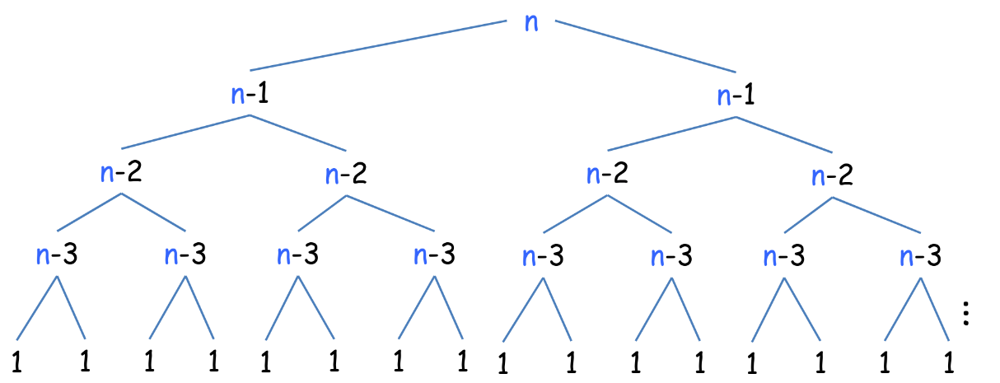

Quanti nodi ha un albero binario completo di altezza $h$?
$$\displaystyle\sum_{i=0}^h 2^i=2^{h+1}-1$$

Quindi, grazie all'altezza dell'albero e al numero dei nodi, possiamo dire che:
$$T(n)=2^{n}-1=\Theta(2^{n})$$

---

**Esempio 4:**

Allora adesso arriviamo a ciò che volevamo analizzare **fibonacci2**:
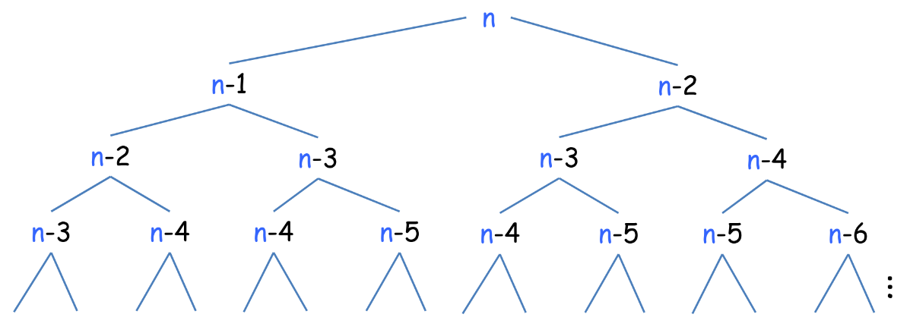

Ogni nodo costa uno, ma quanti nodi ha? Lo sappiamo dalla definizione $\Theta(\phi^n)$ quindi $T(n)=o(2^n)$.

---
### Metodo della sostituzione
> [!info] Procedura
> Il metodo è basato su due passi fondamentali:
> - "Indovinare" la forma della soluzione.
> - Usare l'induzione matematica per provare che la soluzione è quella intuita.

**Esempio:**

$$T(n)=n+T\left( \frac{n}{2} \right),\quad T(1)=1$$

Possiamo pensare che tenda a $T(n)=n\log_{2}(n)$ oppure $T(n)=n$ ma supponiamo di scegliere il secondo. Ora proviamo a dimostrare che $T(n)\leq c\cdot n$:

$$
\begin{array}{l}
\text{Passo base: } & T(1)=1 \leq c \cdot 1 \quad \forall\ c \geq 1 \\
\text{Passo induttivo: } \\
\text{Assumo che } T(k) \leq c \cdot k\quad \forall\ k<n \\
\displaystyle T(n)=n+T\left( \frac{n}{2} \right)\leq n+c \cdot \left( \frac{n}{2} \right) \implies T(n)=\left( \frac{c}{2} +1\right)n \\
\end{array}
$$

Quindi abbiamo che:
$$\left( \frac{c}{2}+1 \right) \leq c \implies c \geq 2 \quad\quad quindi\quad\quad T(n)\leq 2n \implies T(n)=O(n)$$

---
### Divide et Impera
> [!info] Tecnica Algoritmica
> Gli algoritmi basati sul **divide et impera** sono descrivibili in semplici step:
> - **Dividi** il problema (di dimensione *n*) in *a* sotto-problemi di dimensione $\displaystyle\frac{n}{b}$.
> - **Risolvi** i sotto-problemi ricorsivamente.
> - **Riunisci** le soluzioni.

Dato $f(n)$, cioè il tempo per dividere e ricombinare istanze di dimensione n, allora la **relazione di ricorrenza** è la seguente:

$$
T(n)=\begin{cases}
a\cdot T\left( \frac{n}{b} \right)+ f(n) & \text{se}\ \ n>1 \\
\Theta(1) & \text{se}\ \ n=1
\end{cases}
$$

---
### Metodo del Teorema Master
> [!theorem] Teorema Master
> Da ciò imparato precedentemente:
> $$T(n)=\begin{cases}
> a\cdot T\left( \frac{n}{b} \right)+ f(n) & \text{se}\ \ n>1 \\
> \Theta(1) & \text{se}\ \ n=1
> \end{cases}$$

Analizzando quindi relazione di ricorrenza, possiamo imporre una "lotta" tra $\displaystyle n^{\log_{b}(a)}$ e $f(n)$. Quindi:

> [!note] Regola generale
> - Se sono dello stesso ordine asintotico allora $T(n)=\Theta(f(n)\log (n))$
> - Se una delle due è più veloce, allora $T(n)$ tende ad essa.

Analizzando più a fondo possiamo dire che possono esserci quindi **tre soluzioni**:

1. $\displaystyle  T(n)=\Theta (n^{\log_{b}(a)})$  se  $\displaystyle f(n)=O(n^{\log_{b}(a)-\epsilon})$ per $\displaystyle \epsilon>0$

2. $\displaystyle T(n)=\Theta(n^{\log_{b}(a)}\cdot \log(n))$  se  $\displaystyle f(n)=\Theta(n^{\log_{b}(a)})$

3. $\displaystyle T(n)=\Theta(f(n))$  se  $\displaystyle f(n)=\Omega(n^{\log_{b}(a)+\epsilon})$ per $\displaystyle \epsilon>0$ e $\displaystyle a \cdot f\left( \frac{n}{b} \right) \leq c \cdot f(n)$ per $c<1$ e $n$ sufficientemente grande

---
## Algoritmi di Ordinamento

> [!abstract] Introduzione
> Gli **algoritmi di ordinamento** sono procedure fondamentali in informatica che permettono di riorganizzare una sequenza di elementi secondo un determinato criterio di ordinamento. Esistono numerose strategie per risolvere questo problema, ciascuna con caratteristiche, vantaggi e svantaggi specifici.

### Problema dell'Ordinamento
> [!question] Definizione del Problema
> Dato un insieme $S$ di $n$ oggetti presi da un dominio totalmente **ordinato**, ordinare $S$.

**Input:** n numeri

**Output:** una *permutazione* dell'input ordinata in maniera crescente o decrescente.

> [!note]
> Vi sono diversi metodi per farlo e hanno ottimizzazioni e casi diversi. In particolare, distinguiamo tra **algoritmi basati su confronti** e **algoritmi non basati su confronti**.

---
### Delimitazioni inferiori e superiori
#### Complessità di un algoritmo
> Un algoritmo $A$ ha complessità (costo di esecuzione) $O(f(n))$ rispetto ad una certa risorsa di calcolo, se la quantità $r(n)$ di risorsa usata da $A$ nel caso peggiore su $n$ istanze rispetta la relazione $r(n)=O(f(n))$.

> Un algoritmo $A$ ha complessità (costo di esecuzione) $\Omega$(f(n)) rispetto ad una certa risorsa di calcolo, se la quantità $r(n)$ di risorsa usata da $A$ nel caso peggiore su $n$ istanze verifica la relazione $r(n)= \Omega(f(n))$.
#### Complessità di un problema
> Un problema $P$ ha una complessità $O(f(n))$ rispetto ad una risorsa di calcolo se **esiste** un algoritmo che risolve $P$ il cui costo di esecuzione rispetto quella risorsa è $O(f(n))$.

> Un problema $P$ ha una complessità $\Omega(f(n))$ rispetto ad una risorsa di calcolo se **ogni algoritmo** che risolve $P$ ha costo di esecuzione nel caso peggiore $\Omega(f(n))$ rispetto quella risorsa.
### Algoritmo Ottimo
Dato un problema $P$ con complessità $\Omega(f(n))$ rispetto ad una risorsa di calcolo, un algoritmo che risolve $P$ è (asintoticamente) **ottimo** se ha costo di esecuzione $O(f(n))$ rispetto a quella risorsa.
###  Complessità temporale del problema dell'ordinamento
- Upper bound: $O(n^2)$
	- InsertionSort, SelectionSort, QuickSort, BubbleSort.
- Un Upper bound **migliore**: $O(n\log n)$
	- MergeSort, HeapSort.
- Lower bound: $\Omega(n)$
	- Banale: ogni algoritmo che ordina n elementi li deve almeno leggere tutti

Abbiamo un gap di $\log n$ tra upper e lower bound. Si può fare di meglio?

---
### Ordinamento per confronti

> [!info] Introduzione agli algoritmi basati su confronti
> Gli **algoritmi di ordinamento per confronti** determinano l'ordine degli elementi esclusivamente confrontando coppie di elementi. Questa è la classe più comune di algoritmi di ordinamento.

**Operazioni permesse:**
Dati due elementi $a_{i}$ ed $a_{j}$, per determinarne l'ordinamento relativo effettuiamo una delle seguenti operazioni di confronto:

$$a_{i}<a_{j};\quad a_{i}\leq a_{j};\quad a_{i}=a_{j};\quad a_{i}\geq a_{j};\quad a_{i}>a_{j}$$

Non si possono esaminare i valori degli elementi o ottenere informazioni sul loro ordine in altro modo.

> [!important] Proprietà fondamentale
> Ogni algoritmo basato su confronti che ordina $n$ elementi deve fare nel caso peggiore $\Omega(n\log n)$ confronti quindi il $\#\text{ di confronti}$ che un algoritmo esegue è un lower bound del $\#\text{ di passi elementari}$ che esegue.

> [!success] Algoritmi ottimi
> Il MergeSort e il QuickSort sono algoritmi ottimi (almeno dentro la classe di algoritmi basati su confronti).

---
#### Albero di decisione
Gli algoritmi di ordinamento per confronto posso essere descritti in modo astratto tramite gli **alberi di decisione**.

Generalmente un algoritmo di confronto lavora in questo modo:
- Confronta due elementi $a_{i}$ e $a_{j}$.
- Riordina e passa al successivo.

Quindi descrive i confronti di un algoritmo su un determinato input, guardando ogni casistica possibile di confronto. Vengono ignorati i movimenti di dati. Quindi:
- Descrive le diverse sequenze di confronti che A potrebbe fare su un input n.
- Ogni **nodo interno** ha un confronto di tipo $i:j$ con due possibilità.
- Ogni **nodo foglia** è un risultato di un determinato caso.

L'albero di decisione non **è legato al problema** e non è **associato solo ad un algoritmo**.
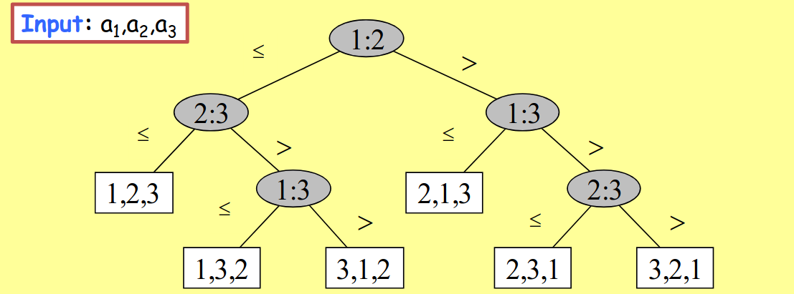
L'albero di decisione è però legato ad un algoritmo e ad una dimensione di istanza, descrivendo le diverse casistiche che possono avvenire di output su una generica istanza di dimensione n. Corrisponde ad una descrizione alternativa di un algoritmo.

##### Proprietà
- I confronti eseguiti sull'algoritmo rappresentano un cammino radice-foglia.
- Un cammino ha caratteristiche diverse a seconda dell'istanza e quindi l'istanza peggiore è il cammino più lungo.
- Il numero di confronti nel caso peggiore è pari all'**altezza dell'albero di decisione**.
- Un albero di decisione di un *algoritmo corretto* che riordina per confronto n elementi deve necessariamente avere **n! foglie**.

> Un **albero binario T** con k foglie ha altezza almeno $\log_{2}(n)$.

##### Il Lower Bound $\Omega(n\log(n))$
Considerando un *qualsiasi algoritmo* che risolve un problema di ordinamento per confronto di n elementi, l'altezza dell'albero di decisione di almeno $\log_{2}(n!)$. Quindi dalla [[4.5 Prodotti#^0c4ae5|Formula di Stirling]] sappiamo che:$$n!=\sqrt{ 2\pi n }\cdot\left( \frac{n}{e} \right)^n$$
Allora possiamo dedurre che:$$h\geq \log_{2}(n!)>\log_{2}\left( \frac{n}{e} \right)^n=n\log_{2}(n)-n\log_{2}(e)=\Omega(n\log(n))$$

---
#### Algoritmi di Ordinamento Quadratico
> [!info] Caratteristiche
> Algoritmi semplici da capire ed implementare, ma poco efficienti. Hanno complessità temporale $O(n^2)$.

##### Selection Sort
> [!tip] Idea dell'algoritmo
> In questo algoritmo, in modo iterativo, cerco l'elemento minimo dell'array e lo sostituisco con la k-esima posizione (quindi estendiamo l'ordinamento a k+1).
>
> Ovviamente in questo algoritmo k risulta essere la posizione su cui abbiamo ordinato.

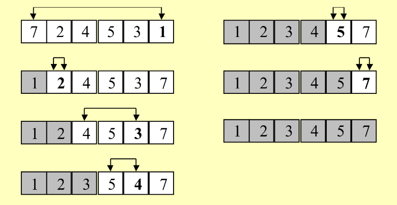

**Pseudo-codice:**
> $\text{SelectionSort}(array\ A)$
> 1.   $\text{for } k=0\text{ to } n-2 \text{ do}$
> 2.      $m = k + 1$
> 3.      $\text{for }j=k+2\text{ to }n\text{ do}$
> 4.         $\text{if }(A[j] < A[m])\text{ then }m=j$
> 5.      $\text{scambia }A[m]\text{ con }A[k+1]$

**Implementazione Python:**
```python
def selection_sort(array: list):
	for i in range(1, len(array)):
		key = arr[i]
		j = i-1
		while j >= 0 and key < arr[j]:
			arr[j + 1] = arr[j]
			j -= 1
		arr[j + 1] = key
	return arr
```

> [!check] Correttezza
> L'algoritmo è banalmente **corretto** e mantiene le seguenti **invarianti**:
> - I primi k+1 elementi sono ordinati.
> - I primi k+1 elementi sono i più piccoli dell'array.

###### Analisi del costo
Chiamiamo:
$$
\begin{array}{r}
T(n)=\text{\# operazioni elementari sul modello RAM a costi uniformi} \\
\text{eseguite dall'algoritmo nel caso peggiore su istanze di dimensione n}
\end{array}
$$

Se ogni linea di codice costa $O(1)$ e ogni ciclo (come si può vedere) viene eseguito al più n volte, avendo due cicli:
$$T(n)\leq 5n^2\cdot O(1)=\Theta (n^2) \implies T(n) =O(n^2)$$

> [!question] Ma l'analisi è **stretta**?

Cioè, $T(n)=\Theta(n^2)$? Analizziamo la linea più importante nel codice che corrisponde a: `if (A[j] < A[m]) then m=j`. Quindi:

$$T(n)\geq \displaystyle\sum_{k=0}^{n-2} (n-k-1)=\displaystyle\sum_{k=0}^{n-1} \frac{n(n-1)}{2}=\Theta (n^2)\quad \implies\quad T(n) = \Omega (n^2)$$

> [!success] Conclusione
> $$T(n)=\Theta (n^2)$$

> [!note] Implementazione
> L'implementazione completa è disponibile in `/Esercizi/`

---
##### Insertion Sort
> [!tip] Idea dell'algoritmo
> Estendiamo l'ordinamento da k a k+1 elementi, posizioniamo l'elemento (k+1)-esimo nella posizione corretta rispetto ai primi k elementi.

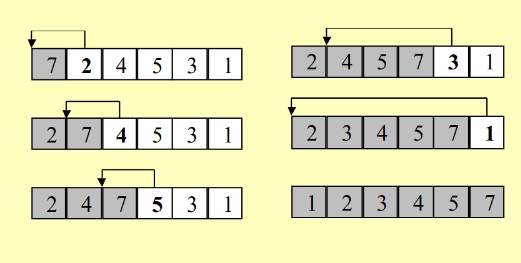

> [!note] Implementazione
> L'implementazione completa è disponibile in `/Esercizi/`

---
##### Bubble Sort
> [!tip] Idea dell'algoritmo
> Eseguiamo n-1 scansioni, dove ad ogni scansione guardiamo le coppie di elementi adiacenti e li scambiamo nell'ordine corretto.

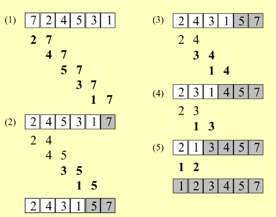

> [!note] Implementazione
> L'implementazione completa è disponibile in `/Esercizi/`

---
#### Algoritmi di Ordinamento Sub-quadratico
> [!info] Caratteristiche
> Algoritmi più complessi ma molto più efficienti, con complessità temporale $O(n\log n)$.

##### Merge Sort
> [!tip] Tecnica utilizzata: Divide et Impera
> Per questo algoritmo usiamo la tecnica **divide et impera**:
> - **Divide:** dividi l'array a metà
> - **Risolvi** i due problemi ricorsivamente
> - **Impera:** fondi le due sotto-sequenze ordinate

**Pseudo-codice principale:**
> $\text{MergeSort}(array A,\ int\ i,\ int\ f)$
> 1.   $\text{if }(i < f)\text{ then}$
> 2.      $\displaystyle m = \left\lfloor  \frac{i+f}{2}  \right\rfloor$
> 3.      $\text{MergeSort}(A,\ i,\ m)$
> 4.      $\text{MergeSort}(A,\ m+1,\ f)$
> 5.      $\text{Merge}(A, i, m, f)$

**Albero di ricorsione:**
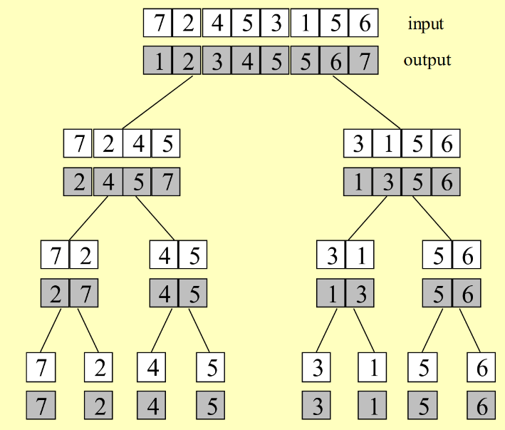

> [!info] Come funziona
> Avendo un array di dimensione `n`, lo dividiamo a metà, eseguiamo la chiamata ricorsiva sulla metà e quando ritorna sarà ordinata, uguale per l'altra metà. Quando entrambe sono ordinate vengono unite tramite il **merge**.

> [!note] Implementazione
> L'implementazione completa è disponibile in `/Esercizi/`

###### Procedura merge
> [!tip] Idea della procedura
> Dati due array ordinati A e B, essi possono essere fusi rapidamente:
> - Estrai ripetutamente il minimo di A e B e copialo nell'array di output fino a che A o B non diventa vuoto.
> - Copia gli elementi dell'array non vuoto alla fine dell'array di output.

**Pseudo-codice:**
> $\text{Merge}(A,\ left,\ mid,\ right)$
> 1.   $\text{Sia X un array ausiliario di lunghezza }f_2 - i_1 + 1$
> 2.   $i = 1;\ left_c = left;\ right_c=mid+1$
> 3.  $\text{while }(left_{c} \leq mid\ and\ right_{c} \leq right) do$
> 4.      $\text{if }(A[left_{c}] \leq A[right_{c}])$
> 5.         $\text{them }X[i] = A[left_{c}]\text{ e incrementa i e }left_c$
> 6.      $\text{else }X[i] = A[k_2]\text{ e incrementa i e }right_{c}$
> 7.   $\text{if }(left_{c} \leq mid)\text{ then copia }A[left_{c},\ mid]\text{ alla fine di X}$
> 8.   $\text{else copia }A[right_{c},\ right]\text{ alla fine di X}$
> 9.  $\text{copia X in }A[left,\ right]$

> [!note] Costo della procedura
> Quanto costa però? Fondendo le due sequenze ordinate costerà $\Theta(n_{1}+n_{2})$ essendo che deve **consumare** uno alla volta ogni elemento degli array.

###### Merge Sort (Tempo di esecuzione)
La complessità temporale del merge sort è descritta dalla seguente relazione di ricorsiva, caratterizzata dal costo di ogni ricorsione e il numero di ricorsioni:

$$T(n)=2\left( T\left( \frac{n}{2} \right) \right)+ O(n)$$

Usando il teorema master otteniamo:

$$T(n)=O(n\cdot \log(n))$$

###### Merge Sort (Memoria Ausiliaria)
> [!info] Complessità spaziale
> La complessità spaziale del Merge Sort è di $\Theta (n)$:
> - La procedura di merge usa memoria pari alla dimensione totale da fondere.
> - Non sono mai attive due procedure di merge contemporaneamente.
> - Ogni chiamata del Merge Sort usa memoria costante (esclusa la parte di merge).
> - Il numero di chiamate attive contemporaneamente è di $O(\log(n))$.

> [!warning]
> Il Merge Sort **non ordina in loco**.

---
##### Quick Sort
^ea3233

> [!info]
> Vi sono diverse versioni del quick sort: caso peggiore, caso medio e versione randomizzata.

> [!tip] Tecnica utilizzata: Divide et Impera
> Generalmente però, usa la tecnica del **divide et impera**:
> - **Divide**: scegli un elemento x della sequenza (perno) e partiziona la sequenza in elementi $\leq x$ e in elementi $>x$.
> - **Risolvi** i due problemi ricorsivamente.
> - **Impera**: restituisci la concatenazione delle due sotto-sequenze ordinate.

###### Funzione Partizione
> [!tip] Come funziona
> La funzione partizione usa un **perno** (ad esempio il primo elemento), scorrendo l'array in parallelo da sinistra verso destra fermandosi su un elemento maggiore del perno e viceversa fermandoci su uno minore del perno, scambia gli elementi e riprendi la scansione.
>
> Fermati quando i due indici sono incrociati.

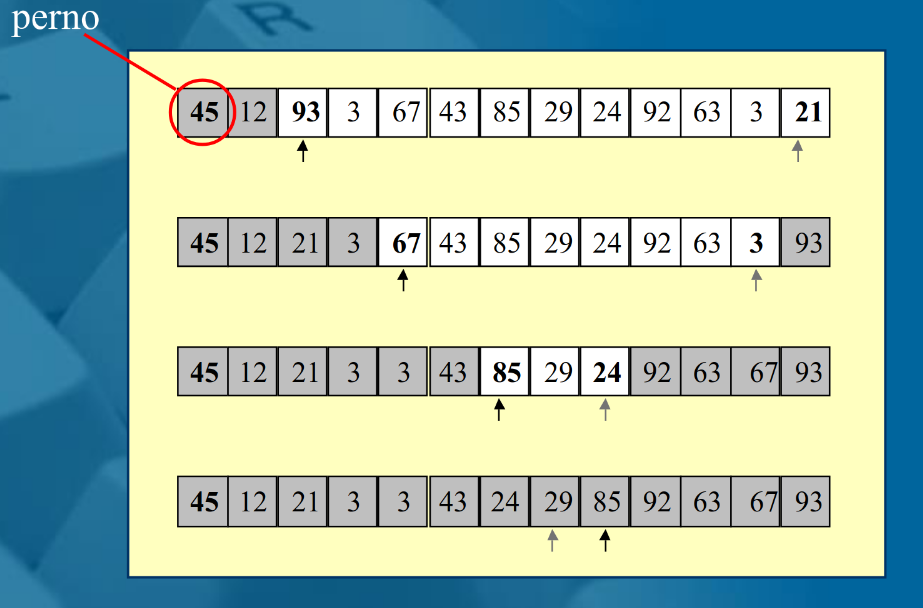

**Pseudo-codice:**
> $\text{Partition}(array\ A,\ int\ i,\ int\ f)\to int$
> 1.   $x=A[i]$
> 2.   $inf = i$
> 3.   $sup = f + 1$
> 4.   $\text{while }(true)\text{ do}$
> 5.      $\text{do }(inf = inf + 1)\text{ while } (inf \leq f\ \ and\ \ A[inf] \leq x)$
> 6.      $\text{do }(sup = sup - 1)\text{ while }(A[sup] > x)$
> 7.       $\text{if }(inf < sup)\text{ then scambia }A[inf] e A[sup]$
> 8.      $\textbf{else break}$
> 9.    $\text{scambia }A[i]\text{ e }A[sup]\text{ // mette il perno al centro}$
> 10.  $\textbf{return}\text{ sup // restituisce la posizione del perno}$

> [!note] Invariante
> Abbiamo una proprietà **invariante**: in ogni istante gli elementi $A[i],\ \dots,\ A[inf-1]$ sono $\leq$ del perno, mentre gli altri ($A[sup+1],\ \dots,\ A[f]$) sono $>$ del perno.

> [!info] Complessità
> Che complessità ha? Beh dovendo leggere tutto l'array il tempo di esecuzione è $O(n)$.

###### Implementazione Quick Sort
**Pseudo-codice completo:**
> $\text{QuickSort}(array A,\ int\ i,\ int\ f)$
> 1.   $\text{if }(i < f)\text{ then}$
> 2.     $m = \text{Partition}(A,\ i,\ f)$
> 3.     $\text{QuickSort}(A,\ i,\ m - 1)$
> 4.     $\text{QuickSort}(A,\ m + 1,\ f)$

**Visualizzazione:**
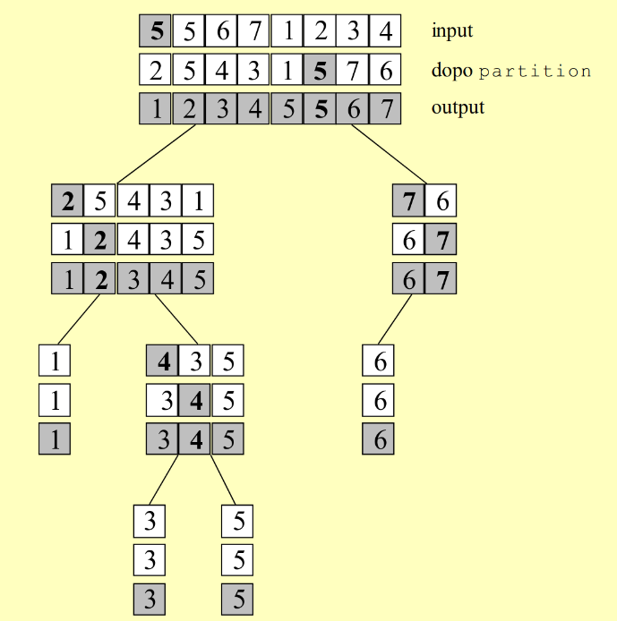

> [!check] Corretto? Certamente!
> Dopo Partition $A[i:m-1]$ contiene $elem \leq perno$, $A[m]$ il perno, $A[m+1:f]\ \ elementi > perno$. Le chiamate ricorsive ordinano $A[i:f]$.

###### Complessità nel caso peggiore o migliore
> [!warning] Caso Peggiore
> Ogni volta che invochiamo partition posiziona almeno un elemento in modo corretto (il perno). Quindi dopo n invocazioni di partition, con costo ognuna di costo $O(n)$ ho un array ordinato. Quindi il costo complessivo è $O(n^{2})$.

Questo si verifica quando il perno scelto ad ogni passo è il minimo o il massimo degli elementi dell'array. La complessità in questo caso è:

$$
\begin{array}{l}
T(n) & = T(n-1)+T(0) + O(n) \\
 & = T(n-1) + O(1) + O(n) \\
& = T(n-1) + O(n) \\
 &  & T(n) = O(n^2)
\end{array}
$$

> [!success] Caso Migliore
> Se fosse perfettamente bilanciato allora nel caso migliore avremmo $O(n\cdot \log(n))$.

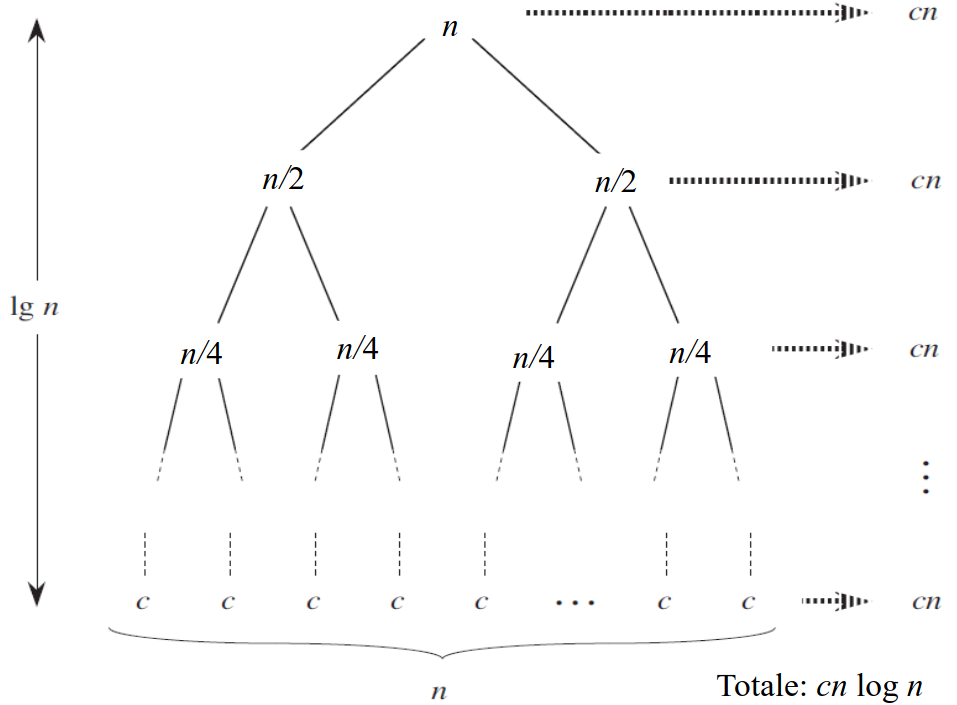

###### Intuizioni nel caso medio
> [!question] Ma nel caso medio?

La partizione può essere sbilanciata, ma più è bilanciata più è veloce, dovremmo trovare ogni volta un perno pessimo per rovinare l'ottimizzazione dell'algoritmo. Sbilanciando però anche a 99-1, sembrando quindi molto instabile, troviamo che...

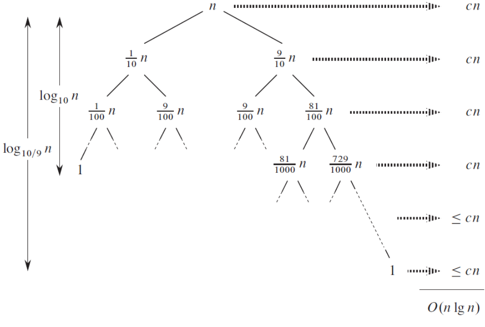

> [!success] Sorpresa!
> La complessità è sempre $O(n\log(n))$!

> [!tip] Randomizzazione
> E se le istanze non sono equiprobabili? Possiamo randomizzare la scelta del perno x. Nella nostra implementazione infatti abbiamo usato un algoritmo Quick Sort Randomizzato.

###### QuickSort Randomizzato
> [!theorem] Complessità QuickSort Randomizzato
> L'algoritmo **QuickSort** randomizzato ordina in loco un array di lunghezza n in tempo $O(n^2)$ nel caso peggiore e $O(n \cdot \log (n))$ con alta probabilità, ovvero con probabilità almeno $\displaystyle1 - \frac{1}{n}$.

> [!note] Implementazione
> L'implementazione completa è disponibile in `/Esercizi/`

---
### Ordinamento senza confronto

> [!info] Introduzione agli algoritmi non basati su confronti
> Gli **algoritmi di ordinamento senza confronto** non determinano l'ordine degli elementi attraverso confronti diretti, ma sfruttano proprietà specifiche dei dati (come valori numerici limitati) per ottenere complessità temporale lineare in certi casi. Questi algoritmi possono superare il limite $\Omega(n\log n)$ degli algoritmi basati su confronti.

**Caratteristiche principali:**
- Non usano confronti diretti tra elementi
- Possono raggiungere complessità $O(n)$ o $O(n+k)$ in certi casi
- Richiedono informazioni specifiche sui dati (es. range di valori)
- Sono particolarmente efficienti quando $k=O(n)$ dove $k$ è il range dei valori

---
#### IntegerSort

> [!tip] Idea dell'algoritmo
> IntegerSort ordina n interi con valori da 1 a k utilizzando un **array di contatori**. L'algoritmo conta quante volte appare ogni valore e poi ricostruisce l'array ordinato.

**Funzionamento:**
1. Manteniamo un *array Y* di contatori dove $Y[x]=\text{numero di volte che appare }x\text{ in X}$
2. Scorriamo l'array ausiliario Y
3. Scriviamo $Y[x]$ volte ogni valore in ordine crescente

**Visualizzazione:**
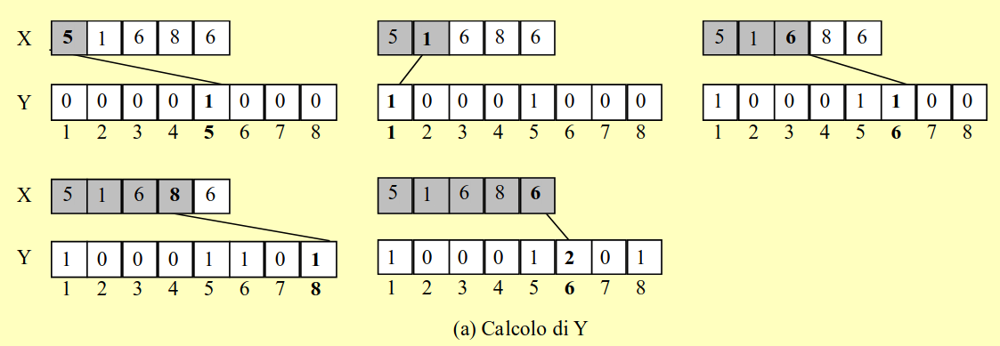
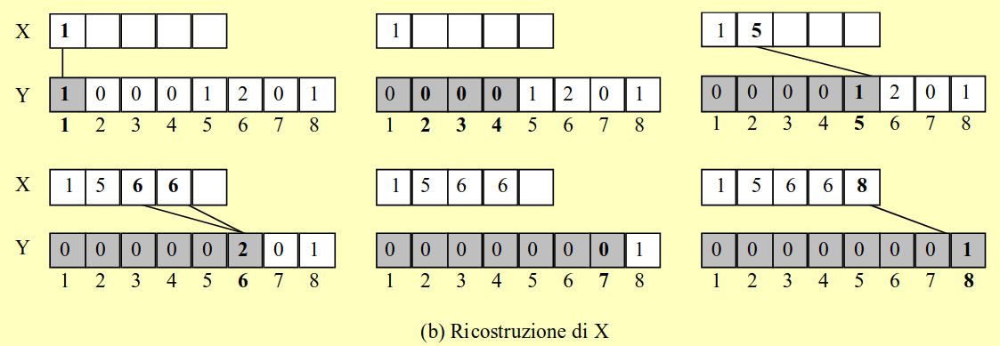

**Pseudo-codice:**
> $IntergerSort(X,\ k)$
> 1.  $\text{Sia Y un array di }k\text{ elementi}$
> 2.  $\textbf{for }i=1\textbf{ to}\text{ k}\textbf{ do }Y[i]=0$
> 3.  $\textbf{for }i=1\textbf{ to}\text{ n}\textbf{ do }\text{ incrementa }X[Y[i]]$
> 4.  $j=1$
> 5.  $\textbf{for }i=1\textbf{ to}\text{ k}\textbf{ do }$
> 6.    $\textbf{while }(Y[i]>0)\textbf{ do}$
> 7.      $X[j]=i$
> 8.      $\text{incrementa j}$
> 9.      $\text{decrementa }Y[i]$

##### Analisi della complessità

Fissato i abbiamo **# volte eseguite** è al più $1+Y[i]$ quindi:

$$\displaystyle\sum_{i=1}^{k}(1+Y[i])=\sum_{i+1}^{k}1+\sum_{i+1}^{k}Y[i]=k+n\implies O(k+n)$$

**Costi delle operazioni:**
- $O(k)$ per creare l'array ausiliario Y con valori a 0
- $O(n)$ per calcolare i valori dei contatori
- $O(n+k)$ per ricostruire X

> [!success] Complessità temporale
> Abbiamo un tempo **lineare** $O(n)$ se $k=O(n)$, che supera il Lower Bound $\Omega(n\log(n))$ degli algoritmi basati su confronti!

> [!note] Implementazione
> L'implementazione completa è disponibile in `/Esercizi/`

---
#### BucketSort

> [!tip] Idea dell'algoritmo
> BucketSort estende IntegerSort per ordinare n **record** con chiavi intere in [1,k]. Invece di usare contatori, utilizza un **array di liste** per mantenere anche le informazioni satellite associate ad ogni elemento.

**Applicazioni tipiche:**
Ordinare record con campi multipli, ad esempio:
- nome, cognome, anno di nascita, matricola, etc.
- Ordinamento per matricola o anno di nascita mantenendo gli altri dati

**Input del problema:**
- n record mantenuti in un array
- ogni elemento dell'array è un record con:
	- **campo chiave** (rispetto al quale ordinare)
	- **altri campi** associati alla chiave (informazione satellite)

**Funzionamento:**
1. Manteniamo un array di liste Y, anziché di contatori
2. La lista Y[i] conterrà tutti gli elementi con chiave uguale a i
3. Alla fine concateniamo le liste in ordine

> [!info] Complessità
> Otteniamo un tempo $O(n+k)$ come per IntegerSort.

**Pseudo-codice:**
> $BucketSort (X,\ k)$
> 1.  $\text{Sia Y un array di dimensione k}$
> 2.  $\textbf{for }i=1\text{ to }k\textbf{ do }Y[i]=\text{lista vuota}$
> 3.  $\textbf{for }i=1\text{ to }n\textbf{ do}$
> 4.    $\text{appendi il record }X[i]\text{ alla lista }Y[chiave(X[i])]$
> 5.  $\textbf{for }i=1\text{ to }k\textbf{ do}$
> 6.    $\text{copia ordinatamente in X gli elementi della lista }Y[i]$

##### Stabilità

> [!question] Definizione di stabilità
> Un algoritmo è **stabile** se preserva l'ordine iniziale tra gli elementi con la stessa chiave.

> [!check] BucketSort è stabile?
> Il BucketSort può essere definito **stabile** se appendiamo gli elementi di X *in coda* alla lista Y[i].

> [!note] Implementazione
> L'implementazione completa è disponibile in `/Esercizi/`

---
#### RadixSort

> [!tip] Idea dell'algoritmo
> RadixSort ordina n interi con valori in [1,k] rappresentandoli in una certa base b ed eseguendo una serie di BucketSort **stabili** sulle singole cifre.

**Strategia:**
Partiamo dalla **cifra meno significativa** verso quella **più significativa**:
- Ordinamento per l'i-esima cifra con una passata di BucketSort (stabile)
- L'i-esima cifra è la **chiave**, il numero completo è l'**informazione satellite**
- L'i-esima cifra è un intero in [0, b-1]

**Esempio di funzionamento:**
$$\begin{matrix} \\
& & 2397 &  & 5924 &  & 5924 &  & 4368 &  & 2397 \\
\text{per }b=10 & & 4368 & \Rightarrow & 2397 & \Rightarrow & 4368 & \Rightarrow & 2397 & \Rightarrow & 4368 \\
& & 5924 &  & 4368 &  & 2397 &  & 5924 &  & 5924
\end{matrix}$$

##### Correttezza

> [!check] Dimostrazione di correttezza
> **Caso 1:** Se x e y hanno una diversa t-esima cifra, la t-esima passata di BucketSort li ordina correttamente.
>
> **Caso 2:** Se x e y hanno la stessa t-esima cifra, la proprietà di **stabilità** del BucketSort li mantiene ordinati correttamente.
>
> **Invariante:** Dopo la t-esima passata di BucketSort, i numeri sono correttamente ordinati rispetto alle t cifre meno significative.

##### Tempo di esecuzione

**Analisi:**
- Numero di passate: $O(\log_{b}k)$
  - Corrisponde al numero di cifre per rappresentare il valore massimo k in base b
- Costo per passata: $O(n+b)$
  - In ogni passata la chiave è un intero in [0, b-1]

**Complessità totale:**
$$O((n+b)\log_{b}k)$$

**Ottimizzazione:**
Se scegliamo $b=\Theta(n)$, si ha:

$$\displaystyle O(n\log_{n}k)=O\left( n \frac{\log k}{\log n} \right)$$

> [!success] Tempo lineare
> Abbiamo tempo **lineare** $O(n)$ se $k=O(n^c)$, con c costante.

> [!note] Implementazione
> L'implementazione completa è disponibile in `/Esercizi/`

---
## Strutture Dati

> [!abstract] Introduzione
> Le **strutture dati** sono organizzazioni fondamentali per memorizzare e gestire dati in modo efficiente. Una buona scelta della struttura dati può migliorare drasticamente le prestazioni di un algoritmo.

### Tipi di dato e Strutture di Dati

> [!info] Definizioni fondamentali
> **Tipo di dato:** Una specifica collezione di oggetti e di operazioni eseguibili su di essi.
> - Esempio: un dizionario mantiene un insieme di elementi con chiavi associate per operazioni di inserimento, cancellazione e ricerca
>
> **Struttura dati:** Un'organizzazione dei dati che permette di memorizzare la collezione e supportare operazioni di un tipo di dato usando meno risorse di calcolo possibili.

**Obiettivi nella progettazione:**
Per progettare una **struttura dati efficiente** bisogna poter eseguire efficientemente le seguenti operazioni:
- Dato un array A, generare velocemente la struttura H
- Trovare il più grande oggetto in H
- Cancellare il più grande oggetto da H

---
### Heap e Heap Sort

> [!tip] Idea generale
> L'**Heap Sort** ha lo stesso approccio incrementale del Selection Sort: seleziona gli elementi dal più grande al più piccolo usando una **struttura di dati efficiente** (heap) che permette estrazione del massimo in tempo $O(\log(n))$.

#### Struttura dati Heap

> [!note] Prerequisiti: Alberi d-ari
> Un **albero d-ario** è un albero con al più d figli per ogni nodo. Un **albero binario** è quindi un albero 2-ario (due figli per nodo).
>
> Un albero d-ario è **completo** se tutti i nodi interni hanno esattamente d figli e le foglie sono tutte allo stesso livello.

**Definizione di Heap:**

Un **heap** associato ad un insieme S è un albero binario radicato con le seguenti proprietà:

1. **Struttura rafforzata:** Completo fino al penultimo livello, con l'ultimo livello compattato a sinistra
2. **Memorizzazione:** Gli elementi di S sono memorizzati nei nodi dell'albero, ogni nodo memorizza un solo elemento con una chiave
3. **Proprietà di ordinamento:** $chiave(padre(v)) \geq chiave(v)$ per ogni nodo v diverso dalla radice

> [!success] Proprietà salienti dell'Heap
> - Il **massimo** è sempre contenuto nella radice
> - Un albero con n nodi ha altezza $O(\log(n))$
> - Può essere rappresentato tramite un **array di dimensione n** grazie alla struttura rafforzata

**Rappresentazione indicizzata:**

Rispettando le proprietà dell'heap, possiamo usare un array dove la posizione $i$ contiene un elemento e valgono le seguenti relazioni:
- **Figlio sinistro** di $i$: posizione $2i$
- **Figlio destro** di $i$: posizione $2i + 1$
- **Padre** di $i$: posizione $\left\lfloor  \frac{i}{2}  \right\rfloor$

> [!note] Implementazione
> Il vettore che rappresenta l'heap è generalmente più grande del numero di elementi. La dimensione effettiva è indicata con $heapsize[A]$.

---
#### Funzione Fix-Heap

> [!tip] Scopo della funzione
> Ripristina la proprietà di ordinamento dell'heap quando c'è un'anomalia nella radice, assumendo che i sottoalberi destro e sinistro siano già heap validi.

**Pseudo-codice:**
> $\text{fixHeap}(nodo\ v,\ heap\ H)$
> 1.    $s=sin(i)$
> 2.     $d=des(i)$
> 3.     $\textbf{if }(s\leq heapsize[A]\text{ e }A[s]>A[i]) \textbf{ then }massimo=s$
> 4.     $\textbf{else }massimo=i$
> 5.     $\textbf{if }(d\leq heapsize[A]\text{ e }A[d]>A[massimo]) \textbf{ then }massimo=d$
> 6.     $\textbf{if }(massimo\not=i)$
> 7.         $\textbf{then }\text{scambia }A[i]\text{ e }A[massimo]$
> 8.            $fixHeap(massimo,\ A)$

**Come funziona:**

L'algoritmo sposta verso il basso le chiavi che non rispettano la proprietà di heap, scambiandole con il figlio di valore maggiore.

**Complessità:**
Nel caso peggiore deve spostare il nodo fino alla fine dell'albero, eseguendo $\log(n)$ operazioni, ciascuna di costo $O(1)$.

> [!success] Complessità temporale
> $$T(n) = O(\log(n))$$

> [!warning] Precondizione
> Questa funzione può essere chiamata **solo se** i sottoalberi destro e sinistro sono già heap validi.

---
#### Estrazione del massimo

> [!tip] Procedura di estrazione
> Operazione fondamentale per estrarre l'elemento con chiave massima dall'heap mantenendo la proprietà di heap.

**Passi dell'algoritmo:**
1. **Sostituisci la radice:** Copia nella radice la chiave contenuta nella foglia più a destra (ultimo elemento dell'heap)
2. **Rimuovi la foglia:** Decrementa $heapsize[A]$ per rimuovere l'ultima foglia
3. **Ripristina l'heap:** Chiama $fixHeap$ sulla radice per ripristinare la proprietà di ordinamento

> [!info] Complessità
> L'operazione richiede tempo $O(\log(n))$ dovuto alla chiamata di fixHeap.

---
#### Costruzione dell'Heap (Heapify)

> [!tip] Tecnica utilizzata: Divide et Impera
> Costruiamo un heap valido da un array arbitrario usando la strategia divide et impera.

**Pseudo-codice:**
> $heapify(\text{heap\ H})$
> 1.  $\textbf{if}(\text{H non è vuoto})\textbf{ then}$
> 2.   $heapify(\text{sottoalbero sinistro di H})$
> 3.   $heapify(\text{sottoalbero destro di H})$
> 4.   $fixHeap(\text{radice di H, H})$

**Strategia:**
- **Dividi:** Considera ricorsivamente i sottoalberi sinistro e destro
- **Risolvi:** Trasforma ricorsivamente i sottoalberi in heap
- **Combina:** Usa fixHeap sulla radice per completare l'heap

> [!note] Implementazione
> L'implementazione completa è disponibile in `/Esercizi/`

---
#### Complessità Heapify

**Analisi:**

Data $h$ l'altezza di un heap con $n$ elementi e sia $n^{'} \geq n$ l'intero tale che un heap con $n^{'}$ elementi ha:
- altezza $h$
- è completo fino all'ultimo livello

Vale quindi che:
$$T(n) \leq T(n^{'})\quad \text{dove}\quad n^{'} \leq 2n$$

Il tempo di esecuzione è:
$$T(n^{'})=2T\left( \frac{n^{'}-1}{2} \right)+O(\log(n^{'}))\leq 2T\left( \frac{n^{'}}{2} \right)+ O(\log(n^{'}))$$

**Applicando il Teorema Master:**

Dal teorema master possiamo dire che $T(n')=O(n^{'})$ e quindi:
$$T(n) \leq T(n^{'})=O(n^{'})=O(2n)=O(n)$$

> [!success] Complessità temporale di Heapify
> $$T(n) = O(n)$$
> Sorprendentemente, costruire un heap da zero richiede tempo **lineare**!

---
#### Max-Heap e Min-Heap

> [!info] Varianti dell'Heap
> Esistono due varianti principali della struttura heap, a seconda dell'elemento che si vuole estrarre rapidamente.

**Max-Heap (visto finora):**
- Proprietà: $chiave(padre(v)) \geq chiave(v)$ per ogni nodo v diverso dalla radice
- Il massimo è nella radice

**Min-Heap:**
- Proprietà: $chiave(padre(v)) \leq chiave(v)$ per ogni nodo v diverso dalla radice
- Il minimo è nella radice

> [!question] Perché usiamo un Max-Heap per HeapSort?
> Perché tramite l'HeapSort con Max-Heap possiamo ordinare **in loco** con memoria costante, posizionando il massimo estratto alla fine dell'array.

---
#### HeapSort

> [!tip] Algoritmo completo
> L'**HeapSort** combina tutte le operazioni viste per creare un algoritmo di ordinamento efficiente che ordina in loco.

**Strategia:**
1. Costruiamo un heap tramite heapify
2. Estraiamo ripetutamente il massimo per n-1 volte
3. Memorizziamo ogni massimo estratto nella posizione appena liberata (dalla destra verso sinistra)

**Pseudo-codice:**
> $heapSort(A)$
> 1.  $heapify(A)$
> 2.  $heapsize[A] = n$
> 3.  $\textbf{for } i=n\text{ down to 2} \textbf{ do}$
> 4.    $\text{scambia }A[1]\text{ e }A[i]$
> 5.    $heapsize[A] = heapsize[A] - 1$
> 6.    $fixHeap(1, A)$

**Complessità:**
- Heapify: $O(n)$
- n-1 estrazioni, ciascuna $O(\log n)$: $O(n \log n)$

> [!success] Caratteristiche di HeapSort
> - **Complessità:** $O(n\cdot \log(n))$ nel caso peggiore
> - **Ordinamento in loco:** usa memoria costante $O(1)$
> - **Non stabile:** non preserva l'ordine relativo di elementi con chiavi uguali

> [!note] Implementazione
> L'implementazione completa è disponibile in `/Esercizi/`

---

### Struttura dati Dizionario

^4be009

> [!info] Tipo di dato astratto
> Un **dizionario** è una struttura dati che mantiene un insieme S di coppie (elemento, chiave) e permette operazioni di inserimento, ricerca e cancellazione basate sulle chiavi.

**Operazioni fondamentali:**
- **Insert(e, k):** Aggiunge ad S una nuova coppia (elemento e, chiave k)
- **Delete(k):** Cancella da S l'elemento con chiave k
- **Search(k):** Restituisce l'elemento nel dizionario con chiave k, oppure null se non esiste

**Implementazioni possibili:**

Vi sono diverse tipologie di implementazioni, a seconda di come viene strutturata la collezione:
- Array non ordinato: $O(1)$ insert, $O(n)$ search/delete
- Array ordinato: $O(n)$ insert, $O(\log n)$ search, $O(n)$ delete
- Liste concatenate
- Tabelle hash
- Alberi di ricerca bilanciati (BST, AVL, Red-Black)

> [!note] Implementazione
> Le implementazioni complete delle varie strutture sono disponibili in `/Esercizi/`

---
### Struttura dati Pila (Stack)

> [!info] Tipo di dato astratto
> Una **pila** (stack) è una struttura dati che gestisce una sequenza di elementi seguendo la politica **LIFO** (Last In, First Out): l'ultimo elemento inserito è il primo ad essere estratto.

**Operazioni fondamentali:**
- **isEmpty() → boolean:** Restituisce `true` se S è vuota, `false` altrimenti
- **push(elem e):** Aggiunge e come ultimo elemento di S (in cima alla pila)
- **pop() → elem:** Rimuove l'ultimo elemento di S e lo restituisce
- **top() → elem:** Restituisce l'ultimo elemento di S senza rimuoverlo

**Applicazioni tipiche:**
- Gestione della ricorsione
- Valutazione di espressioni
- Backtracking negli algoritmi
- Navigazione della cronologia (es. "indietro" nel browser)

> [!note] Implementazione
> L'implementazione completa è disponibile in `/Esercizi/`

---
### Struttura dati Coda (Queue)

> [!info] Tipo di dato astratto
> Una **coda** (queue) è una struttura dati che gestisce una sequenza di elementi seguendo la politica **FIFO** (First In, First Out): il primo elemento inserito è il primo ad essere estratto.

**Operazioni fondamentali:**
- **isEmpty() → boolean:** Restituisce `true` se S è vuota, `false` altrimenti
- **enqueue(elem e):** Aggiunge e come ultimo elemento di S (in coda)
- **dequeue() → elem:** Rimuove il primo elemento di S e lo restituisce
- **first() → elem:** Restituisce il primo elemento di S senza rimuoverlo

**Applicazioni tipiche:**
- Gestione di processi e task scheduling
- Buffer per I/O
- Algoritmi di visita in ampiezza (BFS)
- Gestione di richieste in sistemi distribuiti

> [!note] Implementazione
> L'implementazione completa è disponibile in `/Esercizi/`

---
### Rappresentazione dei dati

> [!info] Paradigmi di rappresentazione
> Esistono due approcci fondamentali per rappresentare strutture dati in memoria, ciascuno con caratteristiche, vantaggi e svantaggi specifici.

#### Rappresentazioni indicizzate

**Caratteristiche:**
- Usano **array e matrici** sfruttando l'indicizzazione diretta
- Gli indici delle celle sono numeri consecutivi
- Accesso in tempo costante $O(1)$ tramite indice

**Vantaggi:**
- Accesso molto rapido agli elementi
- Semplicità di implementazione
- Cache-friendly (località spaziale)

**Svantaggi:**
- **Dimensione fissa:** non è possibile aggiungere nuove celle ad un array
- Spreco di memoria se la dimensione è sovrastimata
- Inserimento/cancellazione costosi (richiedono spostamenti)

---
#### Rappresentazioni collegate

**Caratteristiche:**
- Usano **record collegati** tramite puntatori
- I record possono essere creati e distrutti dinamicamente
- Gli indirizzi in memoria non sono necessariamente consecutivi

**Vantaggi:**
- **Dimensione dinamica:** possiamo aggiungere e togliere record facilmente
- Inserimento/cancellazione efficienti in posizioni note
- Uso efficiente della memoria (alloca solo ciò che serve)

**Svantaggi:**
- Accesso sequenziale più lento
- Overhead di memoria per i puntatori
- Minore località spaziale (peggiore per la cache)

---

### Organizzazione gerarchica dei dati

> [!info] Alberi come strutture gerarchiche
> L'organizzazione **gerarchica** dei dati usa gli **alberi** per rappresentare relazioni padre-figlio tra elementi. Questa struttura è fondamentale per molti algoritmi e applicazioni.

**Definizioni aggiuntive per gli alberi:**
- **Grado di un nodo:** il numero dei suoi figli
- **Antenato:** u è antenato di v se è raggiungibile da v risalendo di padre in padre
- **Discendente:** v è discendente di u se u è un antenato di v

**Visualizzazione:**
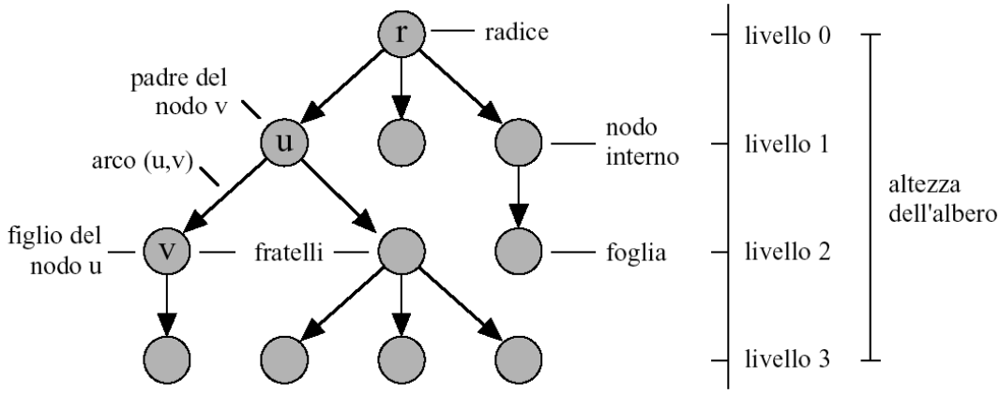

---
#### Rappresentazioni indicizzate di alberi

> [!question] Come rappresentare un albero con array?
> Esistono diverse strategie per rappresentare alberi usando array, ciascuna con trade-off diversi tra spazio e tempo.

##### Vettore dei padri

**Idea:**
Associamo ad ogni cella l'informazione di un nodo e la posizione del padre, usando un vettore di dimensione n.

**Struttura:**
Una generica cella contiene la coppia `(info, parent)` dove:
- **info:** il contenuto informativo del nodo i
- **parent:** l'indice nell'array del padre

**Complessità delle operazioni:**
- Ricerca di un **padre:** $O(1)$
- Ricerca di un **figlio:** $O(n)$

> [!success] Uso ottimale
> Questa rappresentazione è efficiente quando le operazioni più frequenti richiedono di risalire l'albero verso la radice.

---
##### Vettore posizionale

> [!warning] Da completare
> Questa sezione richiede ulteriori approfondimenti.

> [!note] Implementazioni
> Le implementazioni complete delle strutture ad albero sono disponibili in `/Esercizi/`
